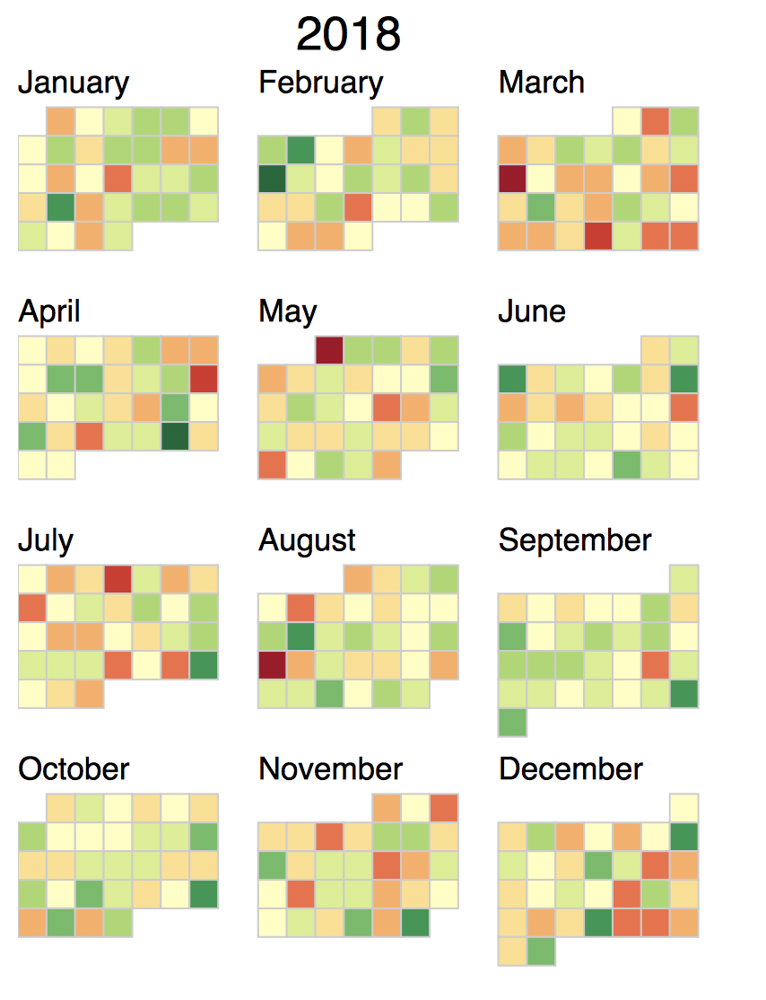

# d3calendar


## Installation

```
devtools::install_github('badbye/d3calendar')
```

## Usage

```R
library(d3calendar)
df = data.frame(date=as.Date('2018-01-01') + 0:364, value=rnorm(365))
df$label = sprintf('%s: %.2f%%', df$date, df$value * 100)
d3calendar(df)
```




## TODO: 
 
- Add legend

- Self-defined colors

- One more plot: https://bl.ocks.org/mbostock/4063318
